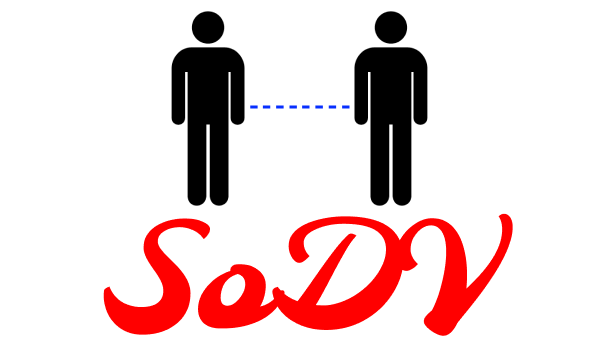

<div align="center">
  
</div>

# Social Distance Violation Detection (SoDV) using pre-trained YOLOv3 model 

COVID-19 social distancing detector using OpenCV, Deep Learning, and Computer Vision. OpenCV and deep learning can be used to implement a social distancing detector. Our configuration file used to keep our implementation neat and tidy. Our detect_people utility function, which detects people in video streams using the YOLO object detection. Our Python driver script, which glues all the pieces together into a full-fledged OpenCV social distancing detector. Apply object detection to detect all people (and only people) in a video stream (see this tutorial on building an OpenCV people counter). Compute the pairwise distances between all detected people. Based on these distances, check to see if any two people are less than N pixels apart.

The initial idea of this project is to use MobileNet SSD with Caffe implementation as the person detection algorithm. [](https://github.com/afiqharith/Social-Distancing-and-Safety-Violation-Alert-ROI-MobileNetSSD-FYP) In November 2020, I decided to further improve the detection algorithm by using YOLOv3 to increase the accuracy.
</br>

Detect the social distance violations in real time using OpenCV and deep learning

> ## ***"Social distancing is the only way to counter Covid-19"***

**Requirements**
- Python
- Numpy
- OpenCV
- Scipy
- Object Detection models (Mobilenet or Googlenet or YOLO)

***Steps***
1. Input the video stream using OpenCV
2. Detect the people in the video stream using any of the object detection models
3. Find the centroids of the identified people and calculate the distance between the centroids
4. Check if the distance calculated above is lesser than the minimum value (in pixels) and consider it as violation
5. Draw the bounding boxes in red color around the person if violating, green color box if the person is following the norms


_💻 Install the dependencies on command line:_

```sh
$ pip3 install -r requirement.txt
```

_💻 To run the program on command line:_

```sh
$ python3 social-distance-yolo.py
```

</br>

### 🎬 Output example:

|  |
| ------------------------------------------ |


**Frame 10 to 500:**

|  |  |  |
| :-----------------------------------------: | :------------------------------------------: | :------------------------------------------: |
|                **FRAME 10**                 |                **FRAME 100**                 |                **FRAME 200**                 |

|  |  |  |
| :------------------------------------------: | :------------------------------------------: | :------------------------------------------: |
|                **FRAME 300**                 |                **FRAME 400**                 |                **FRAME 500**                 |

### 🎯 Accuracy for person detection:

| Dataset            | TP  | TN  | FP  | FN  | %    |
| ------------------ | --- | --- | --- | --- | ---- |
| Oxford Town Centre | 29  | 0   | 0   | 11  | 72.5 |

### 🎯 Accuracy for social distance violation detection:

| Dataset            | TP  | TN  | FP  | FN  | %   |
| ------------------ | --- | --- | --- | --- | --- |
| Oxford Town Centre | NA  | NA  | NA  | NA  | NA  |

### ⛔ Social distance violation detection using distance formula Drawback:

- No camera calibration for intrinsic parameter

### ⏳ Future upgrades:

| Features                                              | Status                                                                |
| ----------------------------------------------------- | --------------------------------------------------------------------- |
| Camera calibration for intrinsic parameter (distance) |  |
| Add facemask detection                                |  |
| upgrade to YOLO v4                                    |  |

---

## Kindly check out below links:

**👀 YOLO Pre-Trained Model** </br>
[](https://pjreddie.com/darknet/yolo/) [](https://github.com/pjreddie/darknet.git)

**📊 Dataset** </br>
MegaPixels: Origins, Ethics, and Privacy Implications of Publicly Available Face Recognition Image Datasets </br>
[](https://megapixels.cc/)

## 🧐 Code of Conduct
You can find our Code of Conduct [here](https://github.com/rajpratyush/Social-Distancing-Detector/blob/main/CODE_OF_CONDUCT.md).

## ❤️ Thanks to our awesome contributors ✨✨
<table>
  <tr>
    <td>
        <a href="https://github.com/rajpratyush/Social-Distancing-Detector/graphs/contributors">
          
        </a>
    </td>
  </tr>
</table>
